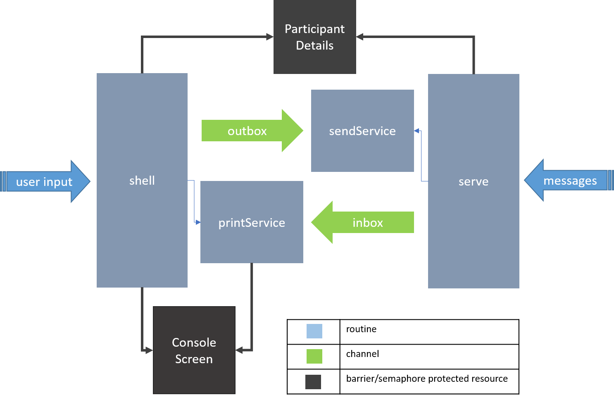

# gobol (گوبول)
A simple console based, cross-platform chat application. *gobol* is a compound
of *Go* (the language) and *bol*/(*بول*) - the Urdu word for "talk", pronounced
'bole'.  

## Installation
You need to have *Go* installed and properly set up to build from source. Type:  
```bash
>> go get github.com/hazrmard/gobol
```  
And the executable should appear in your workspace's `bin` directory. You can
then add it to your PATH for convenience.

## Use  
Start the application by typing:  
```bash
>> gobol.exe -u "AlphanumericUsername" -p PORT_NUMBER
```  

`gobol` has a built-in command interface. All commands are preceded by `\\`.  

To add a user:  
```
\\ add USERNAME@HOST:PORT
```  
Where `HOST` is IP (IPv4 or IPv6) address of the target user, and `PORT` is the
port number their instance of `gobol` is listening on. Multiple users can be
added and any messages typed will be sent to all added users. The user for any
incoming message is automatically added to chat participants. So if you, `A`,
add `B` and send a message, `B` will automatically add you to their list.  

Similarly, to remove a user:  
```
\\ remove USERNAME
```
Note, this does not prevent the user from sending you messages. It only prevents
your messages from being transmitted to the user.  

To send a targeted message:
```
@USERNAME @OTHERUSERNAME Hey, this is a targeted message.
```
Targeted messages are only seen by the users they are addressed to. The messages
appear with the `@USERNAME` part so recipients know it is a targeted message.  

To quit, press `Ctrl+Q`.  

### Under the hood
  

### BTW
`gobol` is my first *Go* project. I started working on it midway through [A
Tour of Go](https://tour.golang.org/welcome). I find that having an idea to
work on, instead of ploughing through "Hello World" examples, provides motivation
to further learn a language. Especially if you are familiar with other languages.
